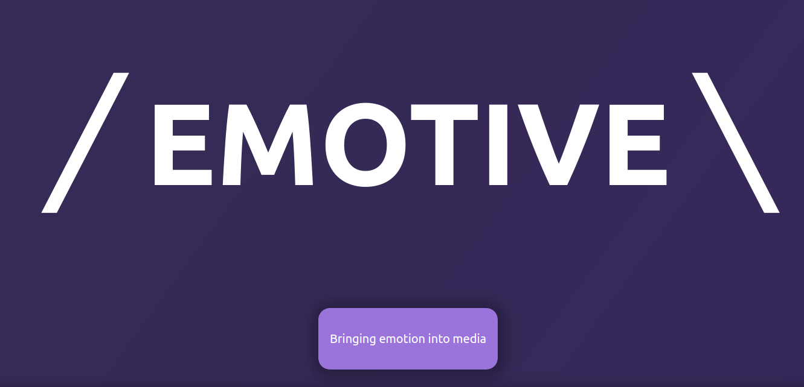
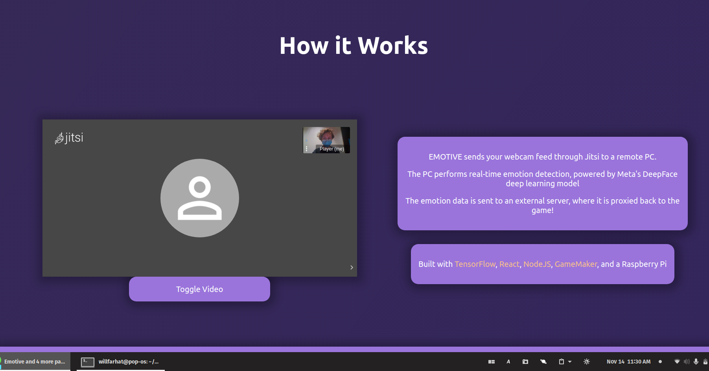
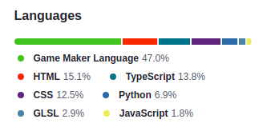

# Emotive

Emotive is a Web API to send a player's emotions into a video game. This can be used as a tool in game design and other forms of interactive entertainment where content can change with the audience.

# How it Works

 

Emotive uses a cumbersome yet effective tech stack. 

Players can simply visit [the website](http://api.willfarhat.com:8000/) to try it out. The site is programmed in React and features a Breakout-inspired game demo programmed in GameMaker Studio 2 and GLSL.

The player's webcam feed is passed through the open-source Jitsi video software, where it can be accessed by any computer running the server program. That computer runs a Python/TensorFlow emotion recognition model, based on Meta's DeepFace training set.

The final emotion data for a player is proxied through a web server - in our case, a Raspberry Pi 4 running NodeJS - back to the player's browser, where it is picked up by the game.

# Future Applications
This type of emotion-based interactivity has far more use-cases than we were able to explore in 24 hours. For example, a game could adjust its difficulty based on a player's frustration, ensuring a fair experience for all.

There are also significant applicaitons outside just gaming. Companies testing software - like games or apps - could use such a system to easily facilitate testing sessions by dynamically changing the user experience. Or, meditiation software could change their content in real-time to better match a user's state of mind.

# Credits
[Will Farhat](willfarhat.com) - Frontend and Backend development

[Levi Pinkert](https://levipinkert.wixsite.com/portfolio) - Game development